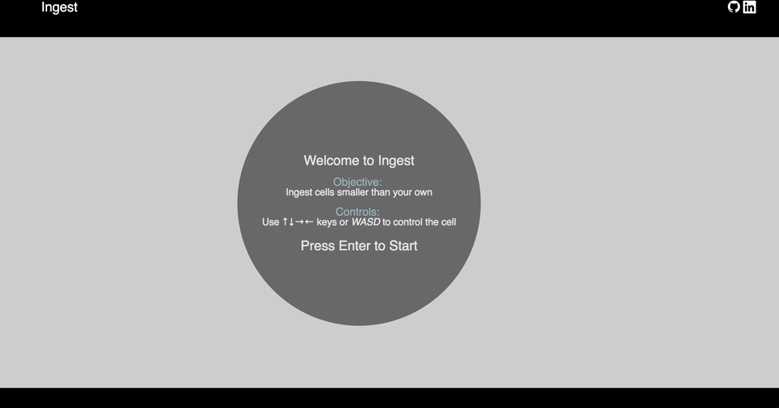

# [Ingest][live_link]
[live_link]: http://www.rushabhs.com/ingest/

## Background

Ingest is a browser based game inspired by agar.io.




## Goal

The goal of the game is to ingest cells which are smaller while avoiding cells that are larger than your own. Use the ↑↓→← or WASD keys to control your cell. You may pause/reset the game at anytime by using the control buttons.

## Logic behind ingesting cells
Collision between two cells is checked by measuring the distance between two cells. If the player's cell collides with a cell larger than itself then the player loses. If the collided cell is smaller than the player's cell then the radius of the smaller cell is added to the player's cell and the smaller cell is removed from the game.

```javascript
/// game.js
eatEvil(){
  this.evils.forEach((evil, idx) => {
    if ( evil.isCollidedWith(this.ball) ) {
      if (evil.radius <= this.ball.radius){
        this.remove(evil);
        this.ball.radius += evil.radius;
      } else {
        this.gameOver = true;
      }
    }
  });
}

/// moving_object.js

isCollidedWith(otherObject){
  return Dist(this.pos, otherObject.pos) <= (parseInt(this.radius) + parseInt(otherObject.radius));
}
```
